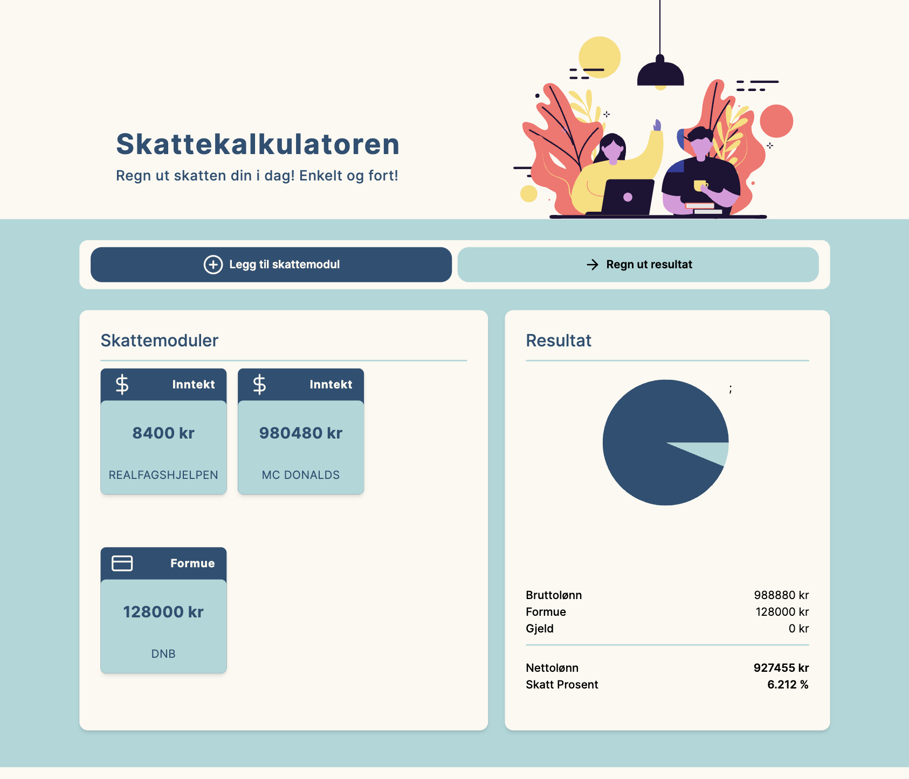
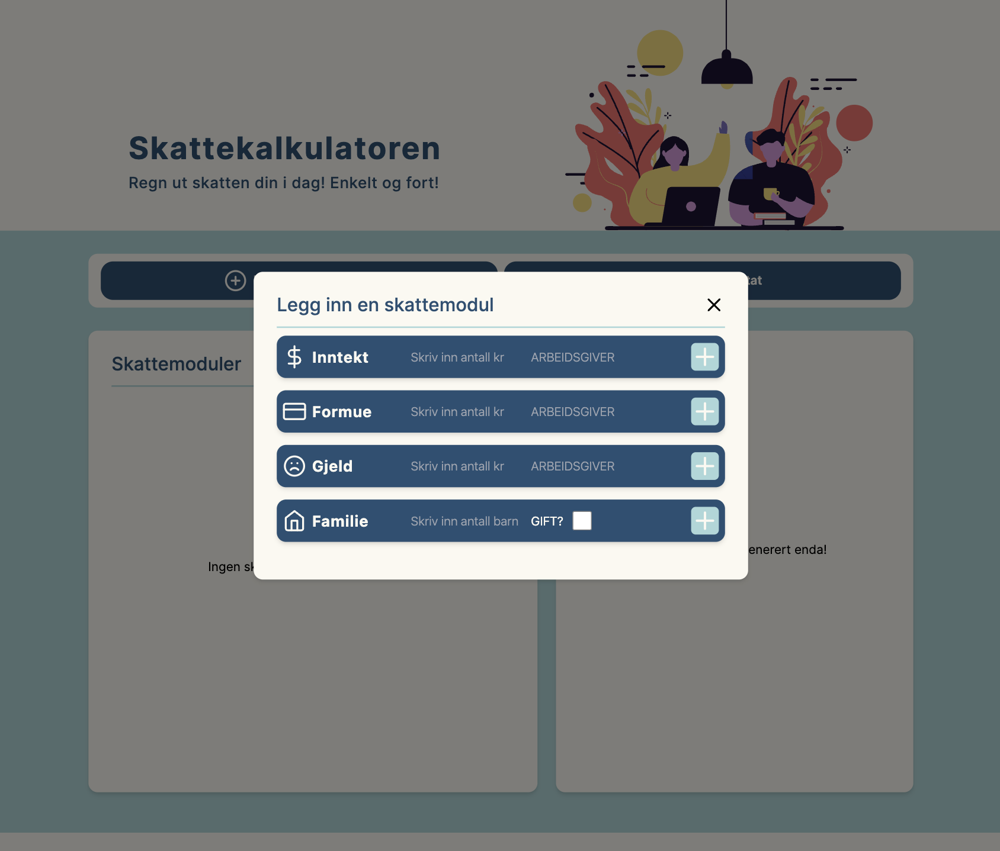

# Skatteetaten-Case-2024
This is a repository for the case given by the developer group at Skatteetaten. This case will be presented in the interview.

<div style="width:70%; margin: auto;">

</div>

## Table of Contents

-   Skatteetaten-Case-2024
    -   [Table of Contents](#table-of-contents)
    -   [Description](#description)
    -   [Installation \& Setup](#installation--setup)
        -   [Installation](#installation)
        -   [Backend](#backend)
        -   [Frontend](#frontend)

## Description

This tax app offers customizable modules for salary, assets, debts, marital status, and number of children, enabling accurate tax calculations quickly and efficiently. Add your details to each module for precise and personalized tax estimations.

<div style="width:70%; margin: auto;">

</div>

## Installation & Setup

### Installation

To run the app locally follow instructions bellow (_you need to have [Node.js](https://nodejs.org/en/) v20.5+ installed_)


To get started clone the repository:
```
git clone https://github.com/A1ice-Z/Skatteetaten-Case-2024.git
```

### Backend

Be sure to go into the correct point in the file structure:

```
cd Backend/
```

You need to install all the required python libraries:

```
pip install -r requirements.txt
```

Now you should be able to run the flask application:

```
flask --app flaskr run --debug
```


### Frontend

Be sure to go into the correct point in the file structure:

```
cd Frontend/
```

```
cd skatteetaten/
```

Install dependencies:

```
npm install
```

Run the app:

```
npm run dev
```

Then click on the link given and play around with the app 